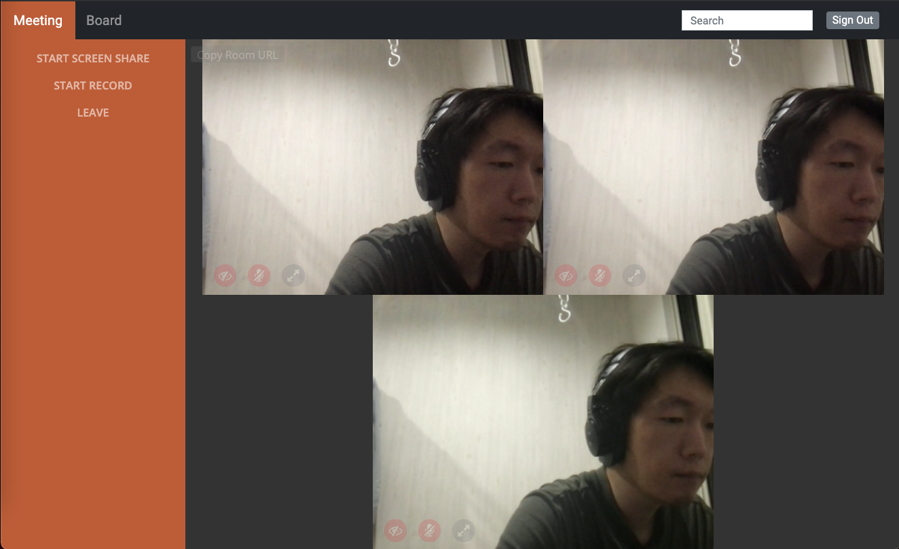

# Packages
| Package | Description |
| - | - |
|<br>firebase| v8, DB And Serverless|
|<br>node| v14, Server Side|
|<br>angular| v11, Web Framework |
|<br>bootstrap| v5, CSS Framework|
|<br>sweetalert2| Modal, Input Form|
|moment|Time Format|
|ngx-markdown<br>prism-themes<br>emoji-toolkit| Posting Blog as MarkDown|

# Run
```
ng serve
```
http://localhost:4300/

# Deploy
- All : ```firebase deploy```
- Only Front End
  - prod : ```firebase deploy --only hosting:prod```
  - stage : ```firebase deploy --only hosting:stage```
- Only Functions
  - ```firebase deploy --only functions```

# Pages
## Meeting


# Link
https://team.showlog.me/#/
